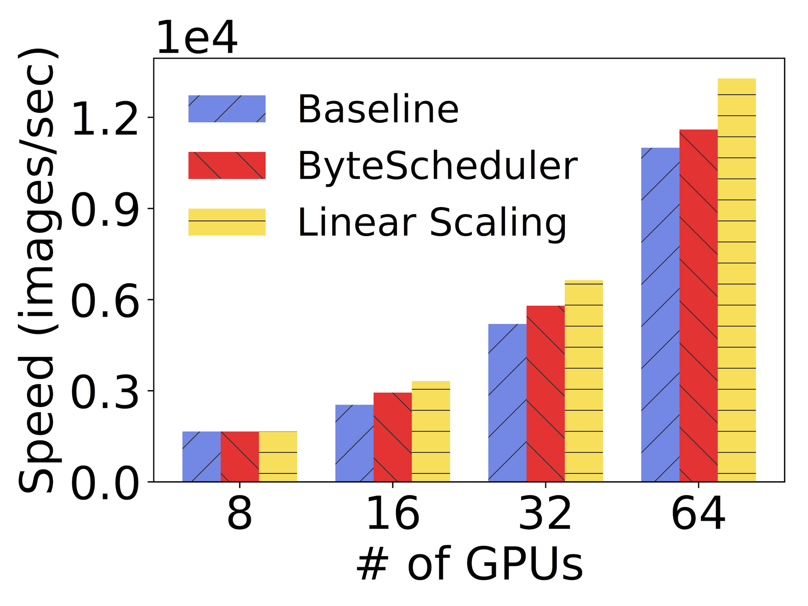
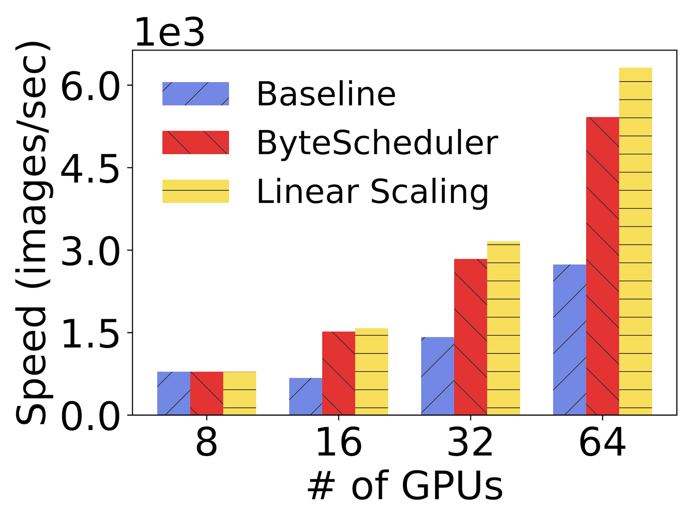
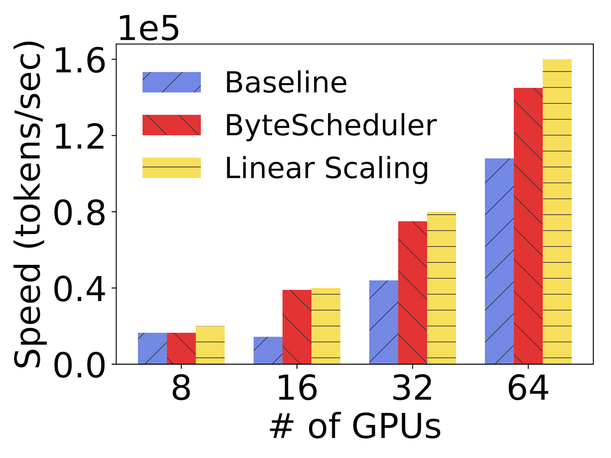
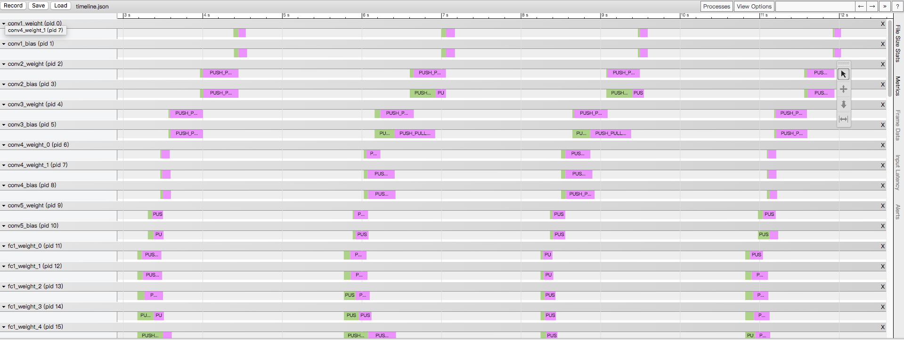

# bytescheduler

Bytescheduler is a communication scheduler for distributed training framework such as PyTorch and MXNet. The goal of ByteScheduler is to make
distributed Deep Learning fast.

**Table of Contents**

- [Why Generic Communication Scheduling?](#Why-Generic-Communication-Scheduling)
- [Install](#install)
- [Usage](#usage)
- [Priority Scheduling](#priority-scheduling)
- [Debugging](#debugging)
- [References](#references)

## Why Generic Communication Scheduling?

Existing distributed training frameworks (MXNet, PyTorch, etc) do not fully utilize the potentials of overlapping computation and communication to speed up neural network training:

1. The dependency graph of computation and communication says gradients of former layers are aggregated later during backward propagation but are needed first in next forward propagation.
2. The best communication granularity may not be layers. Small layers incurs large communication startup overhead. Large layers blocks the aggregation of other layers; it also discourages pipelining of communication and aggregation for parameter server architecture.

ByteScheduler is a generic scheduling layer for distributed training to address the above limitations. It is designed for improving the performance of distributed training by scheduling communication and computation. The basic scheduling principles are:

1. Communication of former layers of a neural network has higher priority and can preempt communication of latter layers.
2. Partition large layers and merge small layers.

In order to let all existing and future ML frameworks benefit from communication scheduling, we design a generic communication scheduler, i.e., ByteScheduler. It sits between the framework (Python) API layer and the engine of popular training frameworks, including MXNet, PyTorch, TensorFlow and potentially others. 
It also works with different communication options, including PS architecture and NCCL. Check [this](docs/ByteScheduler_Arch.png) for ByteSchduler's architecture. 
The difference with BytePS is: ByteScheduler works as a shim between tensor programming and framework engine layer, while BytePS runs as a communication library below the engine. Both provide tensor partitioning and credit-based preemptive scheduling feature.

ByteScheduler is fast. Below is a chart representing the benchmark that was done on GPU
servers with 8 V100 GPUs each connected by RoCE-capable 100 Gbit/s network:

| ResNet50  | VGG16 | Transformer |
| ------------- | ------------- | -------------|
|   |   |  |


ByteScheduler achieves up to 171% speedup.

## Install

To install ByteScheduler, simply run the command below after cloning the source code:

```bash
$ python2 setup install && python3 setup install
```

Check the [Dockerfiles](docker/) for more details when installing with MXNet or PyTorch.

## Usage

To use ByteScheduler, make a few code additions to your program.

### MXNet

See full training [ImageNet](examples/mxnet-image-classification) examples. The script below provides a simple skeleton of code block based on MXNet API.

```python
import mxnet as mx

# Create kvstore
kv = mx.kvstore.create("dist_sync")

# Wrap kvstore using ScheduledKVStore
from bytescheduler.mxnet.kvstore import ScheduledKVStore
kv = ScheduledKVStore(kv)

# Continue
```

### PyTorch

ByteScheduler also supports PyTorch based on Horovod.

Example (also see a full benchmark [example](examples/pytorch_horovod_benchmark.py)):

```python
import torch
import torch.optim as optim
from torchvision import models
import horovod.torch as hvd

# Set up standard model.
model = getattr(models, "resnet50")()
optimizer = optim.SGD(model.parameters(), lr=0.01)

# bytescheduler wrapper
import bytescheduler.pytorch.horovod as bsc
bsc.init()

# Horovod: wrap optimizer with DistributedOptimizer.
optimizer = hvd.DistributedOptimizer(optimizer,
                                     named_parameters=model.named_parameters(),
                                     compression=hvd.Compression.none)
num_steps = 1000

# ByteScheduler, further wrap Horovod DistributedOptimizer
optimizer = bsc.ScheduledOptimizer(model, optimizer, num_steps)

# Continue
```


### TensorFlow

ByteScheduler requires a TF installation in the build environment. To build [the plugin](bytescheduler/tensorflow/plugin.cc), just run the [Makefile](bytescheduler/tensorflow/Makefile).

ByteScheduler currently requires recompiling TF (tested with r1.13) with [tf.patch](bytescheduler/tensorflow/tf.patch) to limit memory leak.

Due to ABI compatibility issue, it is recommended to use the same compiler for the plugin and core TF. More details could be found [here](https://github.com/tensorflow/tensorflow/issues/27067).

For usage, just import the library at the beginning of the TF program:

```python
import tensorflow as tf
tf.load_library('./libplugin.so')
```

It will instrument the distributed TF program, coordinate the scheduling of the parameter updates. 

For tensor partitioning, you need to partition the model manually. For reference, we have a quick patch [benchmarks.patch](examples/tensorflow/benchmarks.patch) for [tensorflow/benchmarks](https://github.com/tensorflow/benchmarks), which adds partitioning to weight variables of large fully-connected layers.


## Priority Scheduling

One of the unique things about ByteScheduler is its ability to schedule communication with tensor partitioning. 

See [here](docs/priority-scheduling.md) for full details and tweaking instructions.

## Debugging

To enable debugging mode, set `BYTESCHEDULER_DEBUG=1` and check log in bytescheduler.log.

Besides, ByteScheduler has the ability to record the timeline of its activity, called ByteScheduler Timeline. To enable it, 
set `BYTESCHEDULER_TIMELINE=/path/to/timeline.json`. After running a few steps, open the trace file using Chrome. 
You can check the queueing time and communication time of each tensor.



Please submit a ticket if you have trouble in using ByteScheduler.

## References

For more details, e.g., interaction with framework engines, scheduling algorithm, check the [SOSP'19 paper](https://i.cs.hku.hk/~cwu/papers/yhpeng-sosp19.pdf).
