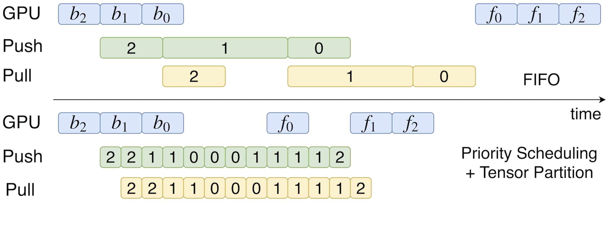

# Communication Scheduling

## An Example of Communication Scheduling

By default, ML framework engines execute communication operations in a FIFO order, because the underlying communication stack, either PS or all-reduce, TCP or RDMA, 
is inherently based on FIFO queues. This is shown in below figure: since push_0 and push_1 both require upload bandwidth, push_1 gets 
executed before push_0; similarly, pull_1 could be executed before pull_0.

However, this is sub-optimal. Because f_0 must be executed before f_1, it is better to finish pull_0 as soon as possible. In the case that 
pull_1 takes a long time and blocks pull_0, FIFO strategy delays pull_0, and hence delays the start time of f_0 and the whole iteration 
process. 

Communication scheduling is a good solution to this problem. In the example above, we can prioritize push_i over push_j if i<j, and do the 
same for pull operations. Then the forward propagation of the next iteration can start earlier, and potentially speed up the training. 

Besides, the tensor sizes can vary significantly (e.g., the smallest tensor is 256B and the largest tensor is over 400MB for VGG16 model). 
A very large tensor, once en-queued in the communication stack, would block other tensors even if they have higher priorities. 
Thus, a more efficient scheduling strategy is to partition the tensors before en-queuing, and allow higher-priority tensors to jump 
ahead of the queue once they arrive. In addition, tensor partitioning is important for utilizing the bi-directional network bandwidth in 
PS architecture. Without partitioning, the pull flow of a large tensor can start only after the push flow of the whole tensor is done. 
Given that the network bandwidth today is usually duplex, this implies 50% waste of the network bandwidth. Finally, partitioning tensors 
can mitigate load imbalance in PS architecture, especially when one or a few tensors are very large and dominate the total model size.

The below contrived example shows a 44% speedup if using priority scheduling with tensor partitioning.

## Scheduling Algorithm

The scheduling algorithm is as follows:

1. For each tensor, partition it into multiple ones if its size is larger than a partition threshold. 
2. Once a tensor is ready to be sent, enqueue it to a queue according to its priority. The priority of a tensor is its index. The closer to input layer the tensor is, the higher priority it has.
3. ByteScheduler uses credit to control communication. If credit is enough, pop the tensor with highest priority, send the tensor and minus the credit by the tensor size. 
4. If credit is not enough, wait for send completion of other tensors. Once a tensor is finished, increase the credit by the size of finished tensor.

The partition threshold can be tweaked using `BYTESCHEDULER_PARTITION` environment variable and its unit is number of parameters. The default value is 1000000. 
For allreduce architecture, the value should be much larger, e.g., 8000000.

The credit can be set using `BYTESCHEDULER_CREDIT` environment variable and its unit is number of parameters. The default value is 4000000.
For allreduce architecture, the value should be larger, e.g., 16000000. 

## Auto-Tuning
Selecting appropriate partition threshold and credit size is critical for high performance. Fortunately, ByteScheduler has auto-tuning mechanism for 
setting the values of partition threshold and credit size. Credit tuning is enabled by default and can be disabled by setting
 `BYTESCHEDULER_CREDIT_TUNING=0`. Partition threshold tuning is disabled by default and can be enabled by setting `BYTESCHEDULER_PARTITION_TUNING=1`.
 
Note that partition threshold tuning for parameter server architecture does not work well, as it is non-trivial to dynamically partition the tensors in parameter servers
in existing machine learning frameworks without deep hacking (e.g., both TensorFlow and MXNet does not support this feature.). A workaround is to restart the training each 
time the partition thershold is changed in the beginning of training (future work). When enabling partition threshold tuning in all-reduce architecture, the environment variables `BYTESCHEDULER_ROOT_IP` and `BYTESCHEDULER_ROOT_PORT` should be set 
so that other workers can communicate with the root worker.
 